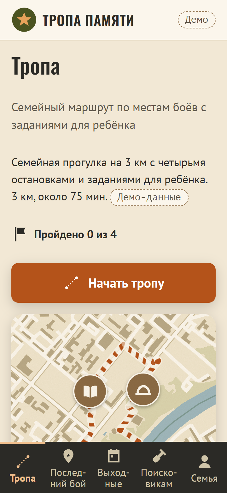
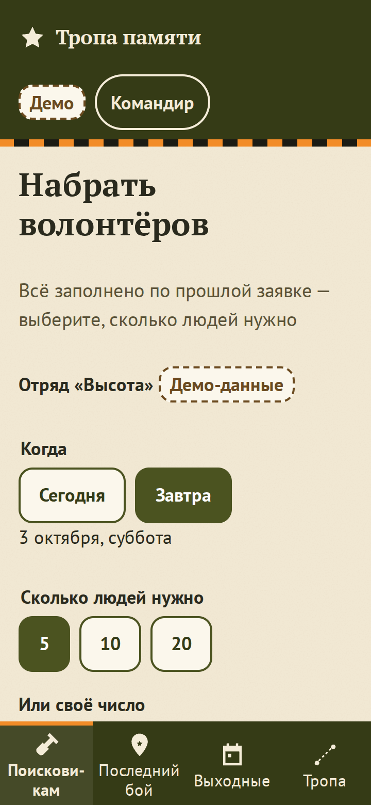
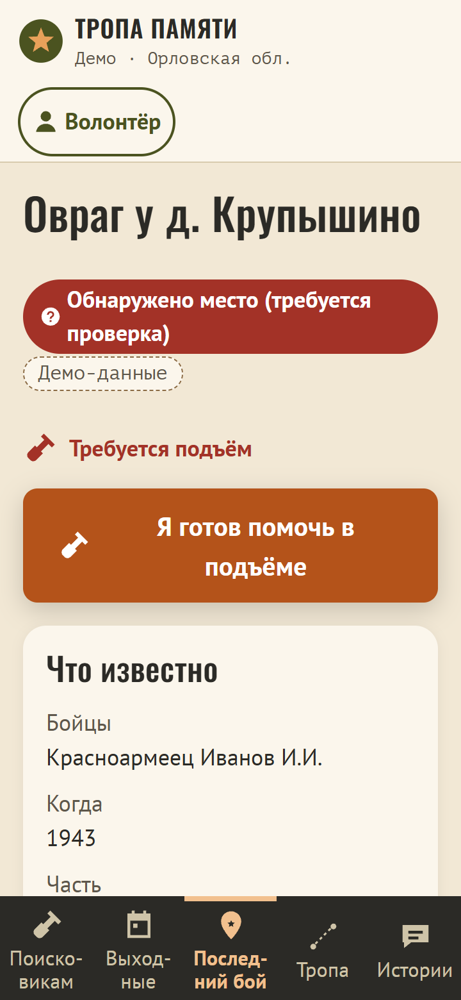

# Тропа памяти: Последний бой

Геоплатформа памяти о Великой Отечественной войне на материале Орловской области. Кейс хакатона «Маршруты победы» ([текст кейса](docs/case/CASE.md)).

Семейные квест-маршруты по местам боёв, штаб поисковых отрядов со сборами и выездами, карта «Последний бой» для мест гибели бойцов, народный архив с проверкой краеведами и «живое фото».

## Демо

**https://team-shpilit.github.io/lexa-lepexa/** — открывается с телефона и ноутбука, без установки и регистрации.


Роль выбирается на первом экране. Все данные, кроме памятников из OpenStreetMap, демонстрационные и помечены в интерфейсе. Сценарий показа на 3 минуты — [docs/DEMO.md](docs/DEMO.md).

| Семья: тропа                                           | Командир: заявка                                              | «Последний бой»                                                          |
| ------------------------------------------------------ | ------------------------------------------------------------- | ------------------------------------------------------------------------ |
|  |  |  |

## Три шага на роль

| Роль                    | Что сделать                                                                                                                                |
| ----------------------- | ------------------------------------------------------------------------------------------------------------------------------------------ |
| Семья                   | «Семья» → «Начать тропу» → ответить на задание у точки. 4 точки, около 3 км, финиш со штампами                                             |
| Волонтёр                | «Волонтёр» → «Поисковикам» → «Стать частью команды» или «Поддержать сбор». На вкладке «Последний бой» — «Сообщать о находках рядом»        |
| Командир отряда         | «Командир отряда» → «Поисковикам» → «Набрать волонтёров» → «10» → «Опубликовать». Место гибели — «Последний бой» → «Отметить место гибели» |
| Краевед, учитель, музей | «Краевед» → «Истории» → «Проверить истории». В «Последнем бою» — «Подтвердить по архиву» с томом и страницей Книги Памяти                  |

## Что из кейса где

| Задача кейса                               | Где в продукте                                                                                                                      |
| ------------------------------------------ | ----------------------------------------------------------------------------------------------------------------------------------- |
| 1. Карта: захоронения, бои, памятники      | «Истории» → «Хроника и памятники»: слои «Бои / Памятники / Захоронения», фильтр лет, 84 памятника войны из OpenStreetMap            |
| 2. Семейный навигатор                      | «Тропа»: маршрут ≈3 км, 4 точки (Звезда, Шлем, Книга), «след танка», задания для ребёнка, прогресс на устройстве                    |
| 3. «Поисковый штаб», карта потребностей    | «Поисковикам»: счётчик найденных бойцов, лента заявок, «Списком / На карте» — где нужны люди и где деньги                           |
| 4. Краудфандинг и «Выходные с поисковиком» | Целевые сборы «Поднять бойца», «Экипировать отряд», бензин (тестовый платёж). «Выходные»: даты, запись, чек-лист новичка            |
| 5. Коллективные заявки                     | Карточка выезда → «Записать группу: школу, клуб или семью». Командир принимает или просит уточнить                                  |
| 6. «Живая память»                          | «Истории»: любой рассказывает, краевед проверяет по чек-листу, значок «Подтверждено»                                                |
| 7. «Живое фото»                            | «Истории» → «Живое фото»: камера на снимок с QR-кодом, и боец говорит. «Оживить своё фото» — загрузка, фраза из кейса, согласие     |
| 8. «Последний бой»                         | Карта мест по трём статусам, форма командира, уведомление подписчикам в радиусе 20 км, смена статуса по архиву, закрытые координаты |

Чего нет — в разделе «Ограничения».

## Как устроено

| Часть    | Стек                                                                         | Папка                                    |
| -------- | ---------------------------------------------------------------------------- | ---------------------------------------- |
| Фронтенд | React 19, TypeScript strict, Vite, MapLibre GL + OpenFreeMap, TanStack Query | [`frontend/`](frontend/README.md)        |
| Бэкенд   | FastAPI, SQLAlchemy, Alembic, PostgreSQL                                     | [`backend/`](backend/README.md)          |
| Контракт | zod-схемы → OpenAPI, адаптеры mock и live                                    | [`docs/openapi.json`](docs/openapi.json) |

Качество фронтенда проверяет одна команда `npm run verify`: проверка типов, линтер, модульные и компонентные тесты, сквозные тесты на телефоне (360 px) и ноутбуке (1366 px) с проверкой доступности WCAG 2.1 AA.

Интерфейс рассчитан на детей и пожилых: на каждом экране одна главная кнопка, зоны нажатия 48 px, статус всегда подписан, а не только окрашен.

```bash
cd frontend && npm ci && npm run dev        # http://localhost:5173, демо-данные
cd backend && docker compose up --build -d  # API на :8000, демо-данные заполняются при старте
```

## Этика

- Точные координаты мест гибели видят только командиры отрядов и краеведы, остальные — район около 500 м. Это защита от «чёрных копателей».
- «Живое фото» — только с согласия родственников, с плашкой «Реконструкция с помощью ИИ» и оговоркой из кейса.
- У каждого факта есть источник. Демо-данные помечены. Геймификация без «очков за погибших».
- Платежи — только тестовый режим.

## Ограничения и дорожная карта

- Бэкенд закрывает 11 из 30 операций контракта (справочники, «Последний бой», подписки, уведомления). Демо работает на демо-данных в браузере.
- Ролик «живого фото» по своему снимку пока не генерируется: снимок сохраняется, показывается пример. Генерация — серверная очередь (говорящее лицо + синтез речи).
- Нет автопостроения маршрутов, аудиогида и AR-точек на тропе, рейтинга гидов, push при закрытой вкладке, офлайн-режима.
- Данные жюри (`mock_graves.csv`, `mock_battles.json`, `mock_teams.json`) не получены. Загрузчик готов: `npm run fixtures`.
- Дальше: Android через Capacitor из той же кодовой базы, RuStore, разбор томов «Книги Памяти».
